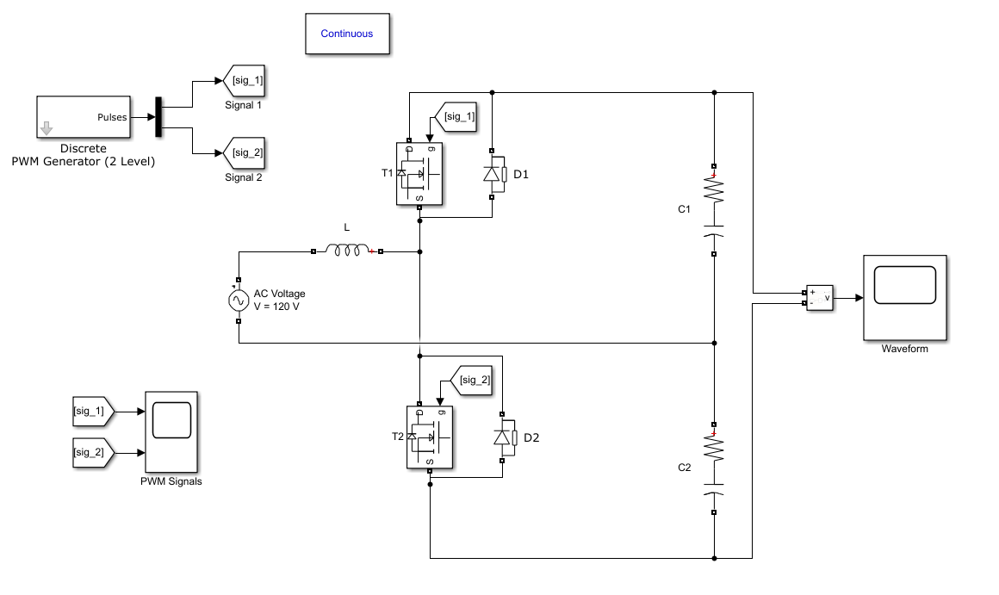
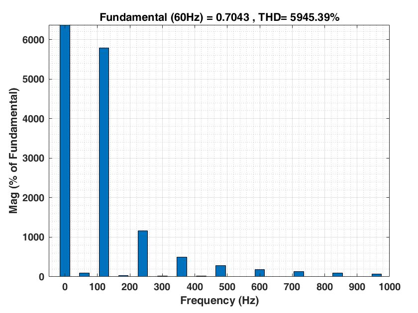
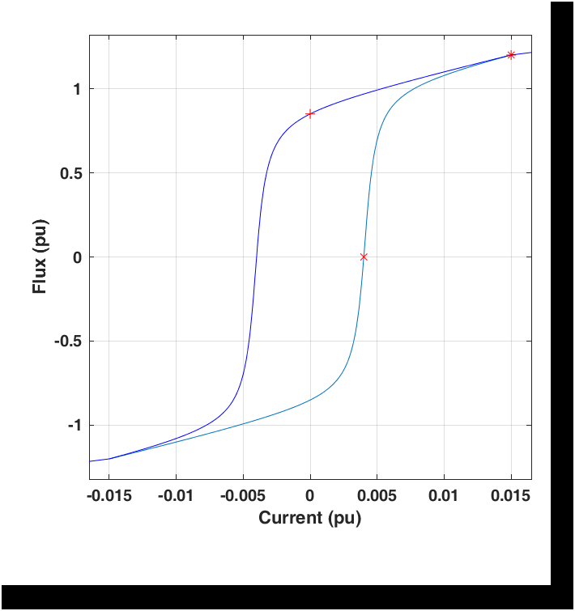
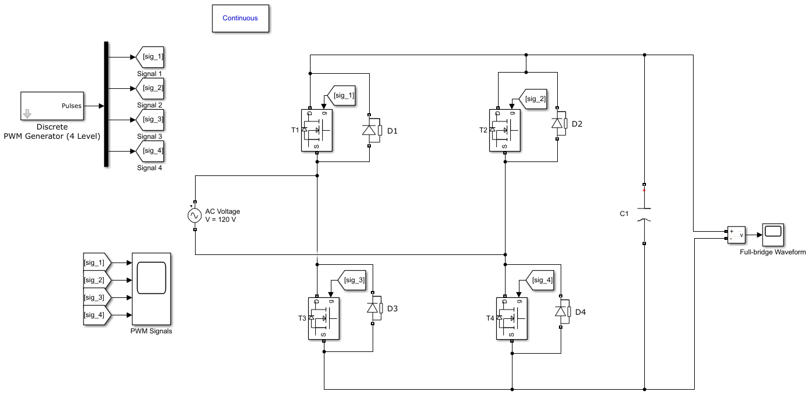
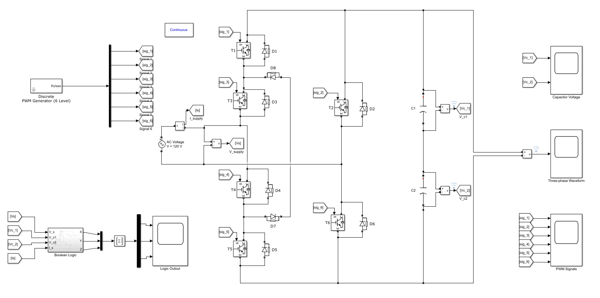

# AC_DC_Converter
Simulink models for half-bridge, full-bridge, and three-phase AC-DC converter. This represents a small part of a project in power electronics. These circuit simulations are helpful in creating chargin cables or generic inverter design. The switches in all three models are automated with PWM signals appropriate to each design.

As mentioned, three models are included.
### Half-bridge

The powergui tool in Simulink also enables a fast fourier transport and a hysteresis design tool. See it used below for the output voltage waveform.

And here are the remaining two more complex models:
### Half-bridge

### Three-phase

This last model also has a designed logic circuit that can technically replace the PWM signal generator if required.

## Built With

* [Matlab R2019b](https://www.mathworks.com/products/matlab/whatsnew.html) - Matlab version used
* [Simulink](https://www.mathworks.com/products/simulink.html) - Model block simulating module (Version 10.0)
* [Control Systems Toolbox](https://www.mathworks.com/products/control.html) - Required toolbox for controller tuning

